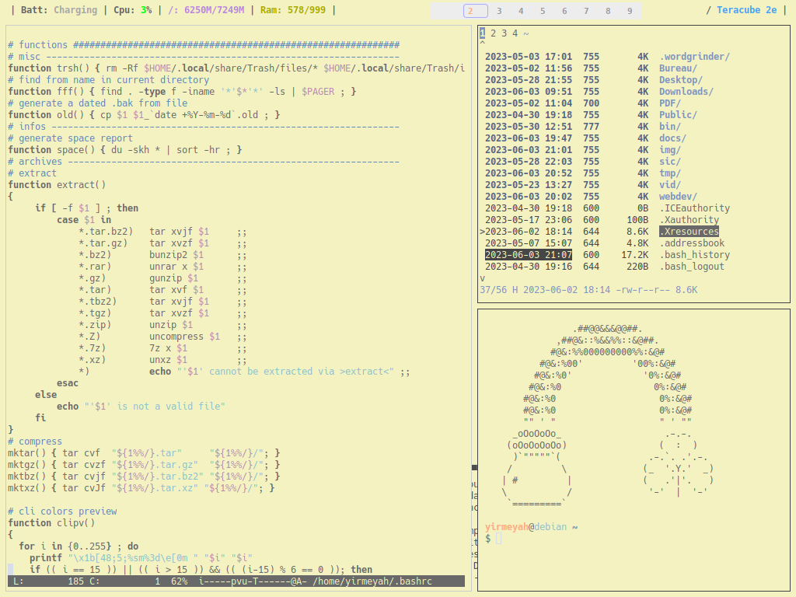
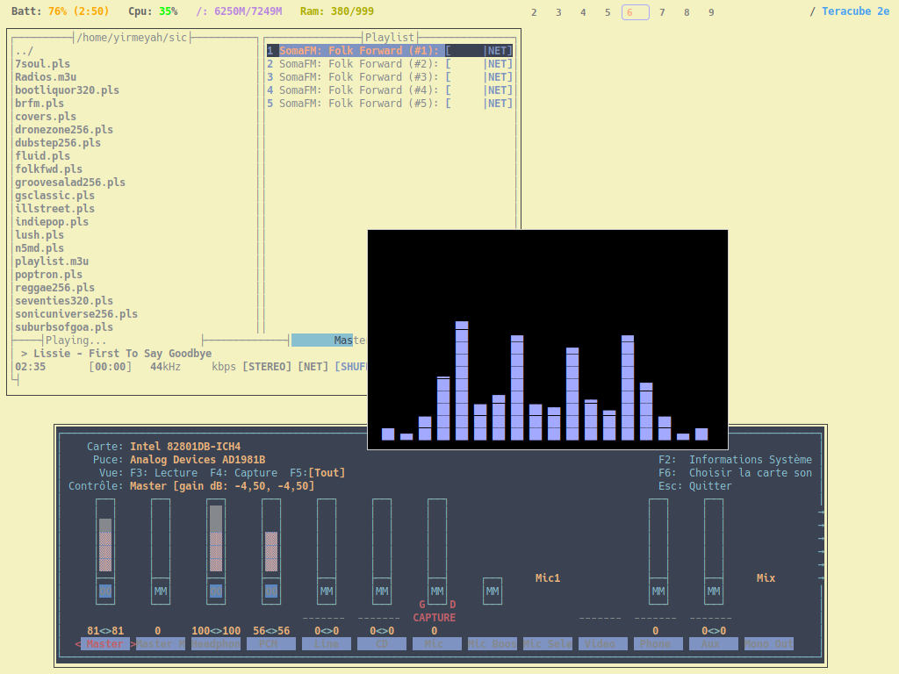
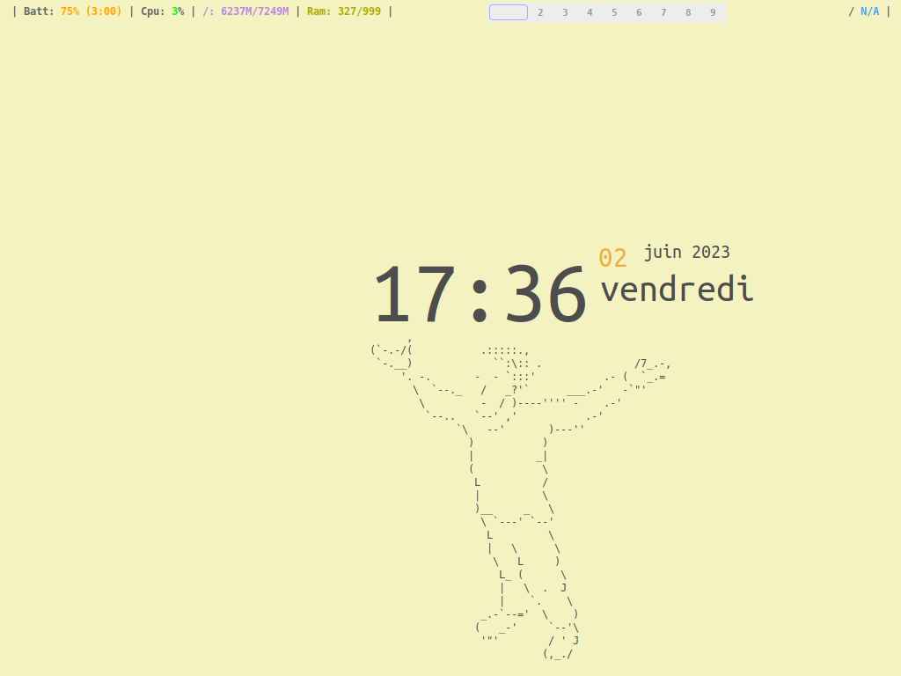

# FrankenWM-configs 

*"monsterwm's bastard child"* or *"not the wm your desktop needs, but the one
it deserves"*

*Et je peux affirmer que c'est le gestionnaire de fenêtre que mon bon vieux IBM Thinkpad T42 
méritait et ce dont il avait besoin!*
 

 

 

## Présentation:

Merci et félicitations à sulami: [https://github.com/sulami/FrankenWM](https://github.com/sulami/FrankenWM)

FrankenWM est un très bon [gestionnaire de fenêtres par pavage](https://fr.wikipedia.org/wiki/Gestionnaire_de_fen%C3%AAtres_par_pavage),
léger, rapide, plein de fonctions et très bien documenté. Il est dynamique, comparable à **dwm** ou **Awesome** et comporte donc 
divers mode de positionnement des fenêtres: v-stack, b-stack, grid, fibonacci, dualstack, mises en page égales et monocle.
Il est possible de modifier les espaces entre les fenêtres.

Selon l'auteur, il était autrefois basé sur **monsterwm** mais a subi de nombreux et importants changements, 
ainsi que de nombreux correctifs. Il est composé aussi de nombreux "morceaux" provenant d'autres gestionnaires
de fenêtre, d'où le nom *"franken"*.

Tous les paramètres doivent être définis avant compilation en éditant et modifiant le fichier `config.h`. 
FrankenWM ne dispose pas de barre d'état, mais peut prendre en charge une de votre choix, un espace préconfiguré a été prévu à cet effet 
en haut de l'écran.

 

## Installer:

`xcb` et `xcb-utils` sont nécessaires. Cloner le dépôt. Copier `config.def.h` en `config.h` afin de l'éditer et de le modifier 
à votre guise. Compiler et installer:

    $ cp config.def.h config.h
    $ $EDITOR config.h
    $ make
    $ make install

 

## Configurer:

La configuration se fait donc par l'édition et la modification du fichier `config.h` avant compilation de FrankenWM.

Le mien ressemble à ça: [config.h](config.h)

<u>**À noter:**</u>
- Modifier comme on le souhaite les raccourcis clavier  
- L'application de règles est possible, comme ouvrir telle application sur tel bureau en mode *"float"*, etc.
- Ne choisir qu'un certain nombre de bureaux
- À part *dmenu*, il possible de paramétrer le ou les raccourcis clavier d'autres lanceurs d'applications 
- Très pratique: on peut paramétrer un raccourci clavier afin de lancer au démarrage de FrankenWM un *autostart* qui lancera à son tour
diverses applications comme les barres, surveillance de courriels et autres.
- Un exemple, dans mon cas: la combinaison MOD1(la touche Alt)+F5, lance un sous-menu (utilisant dmenu) qui permet de choisir
un navigateur Internet parmi d'autres et de le lancer. Voici le fichier: [wwwmenu.sh](wwwmenu.sh)
 
 

## utiliser:

Une très bonne page de manuel, expliquant les différents modes de pavage et les raccourcis clavier, a été écrite par l'auteur:
[frankenwm.1](https://github.com/sulami/frankenwm/blob/master/frankenwm.1)

Je l'ai modifiée en fonction de mon clavier (il n'y a pas de touche *SUPER* sur mon Thinkpad), compressée en `.gzip` 
et collée dans `/usr/share/man/man1`.

 

## Barres:
J'en utilse 2, [xmobar](https://codeberg.org/xmobar/xmobar) pour quelques informations du système et [tint2](https://gitlab.com/o9000/tint2/)
 comme *"workspace pager"*.

Voici les configs:
- [tint2rc](tint2rc)
- [xmobarrc](xmobarrc)

 

## Quelques programmes utilisés:

(dont je remercie les développeurs au passage)
- [suckless-tools](https://tools.suckless.org/)
- xterm, lxterminal, [mtm](https://github.com/deadpixi/mtm)
- conky
- [nnn](https://github.com/jarun/nnn), ranger
- [micro](https://micro-editor.github.io/), ne
- lynx, w3m
- MOC, [pmrp](https://github.com/hakerdefo/pmrp), cava
- Et tant d'autres minimalistes ...

 

## Captures d'écran:

