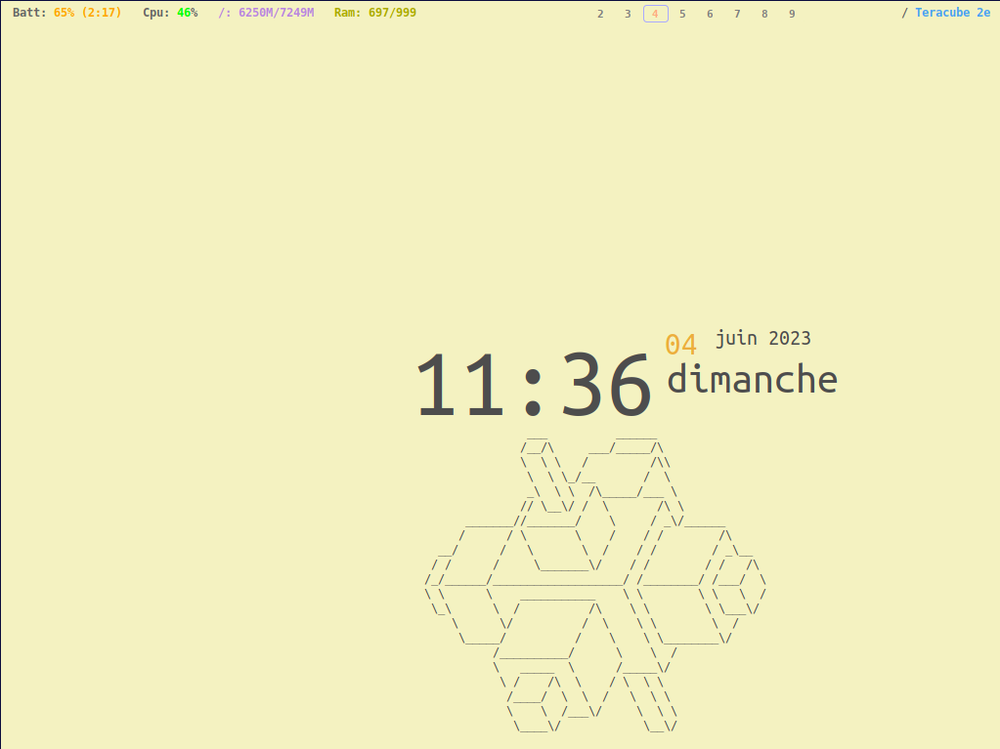
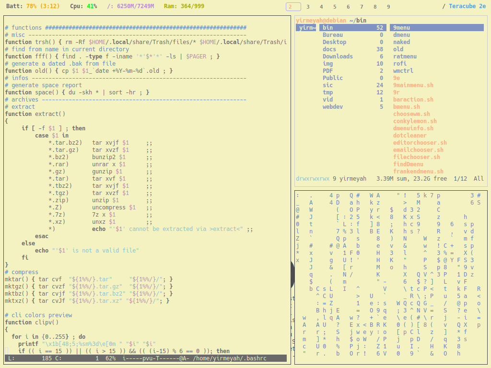

# FrankenWM-configs 

*"monsterwm's bastard child"* or *"not the wm your desktop needs, but the one
it deserves"*

*Et je peux affirmer que c'est le gestionnaire de fenêtre que mon bon vieux IBM Thinkpad T42 
méritait et celui dont il avait besoin!*

<br>


<br>


<br>

## Présentation:

Merci et félicitations à sulami: [https://github.com/sulami/FrankenWM](https://github.com/sulami/FrankenWM)

FrankenWM est un très bon [gestionnaire de fenêtres par pavage](https://fr.wikipedia.org/wiki/Gestionnaire_de_fen%C3%AAtres_par_pavage),
léger, rapide, plein de fonctions et très bien documenté. Il est dynamique, comparable à **dwm** ou **Awesome** et comporte donc 
divers mode de positionnement des fenêtres: v-stack, b-stack, grid, fibonacci, dualstack, mises en page égales et monocle.
Il est possible de modifier les espaces (*"gap"*) entre les fenêtres.

Selon l'auteur, il était autrefois basé sur **monsterwm** mais a subi de nombreux et importants changements, 
ainsi que de nombreux correctifs. Il est aussi composé de divers "morceaux" provenant d'autres gestionnaires
de fenêtre, d'où le nom *"franken"*.

Tous les paramètres doivent être définis avant compilation en éditant et modifiant le fichier `config.h`.<br>
FrankenWM ne dispose pas de barre d'état, mais peut prendre en charge celle de votre choix. 
Un espace pré-configuré a été prévu à cet effet en haut de l'écran.

<br>

## Installer:

On trouve tous les détails sur la page du dépôt officiel: [https://github.com/sulami/FrankenWM](https://github.com/sulami/FrankenWM)
<br>
Sinon, `xcb` et `xcb-utils` sont nécessaires. Cloner le dépôt. Copier `config.def.h` en `config.h` afin de l'éditer et de le modifier 
à votre guise. Compiler et installer:

    $ cp config.def.h config.h
    $ $EDITOR config.h
    $ make
    $ make install

Dans mon cas, je l'ai installé sur une **Debian 11 32bits**.

<br>

## Configurer:

La configuration se fait donc par l'édition et la modification du fichier `config.h` avant compilation de FrankenWM.

Le mien ressemble à ça: [config.h](config.h)

### <u>À noter:</u>
- Modifier comme on le souhaite les raccourcis clavier  
- L'application de règles est possible, comme ouvrir telle application sur tel bureau en mode *"float"*, etc.
- Ne choisir qu'un certain nombre de bureaux
- À part *dmenu*, il possible de paramétrer le ou les raccourcis clavier pour d'autres lanceurs d'applications. J'utilise **rofi**
et le lanceur de **nnn file manager**:
```
xterm -e  ~/.config/nnn/plugins/launch
```
&nbsp;&nbsp;&nbsp;&nbsp; et au passage `frankendmenu.sh`:
```bash
#!/bin/sh
dmenu_run -i -fn 'Hack-11' -nb '#ddd5ff' -nf '#7F7F7F' -sb '#f4f2c1' -sf '#7F7F7F' -p 'Applications >>> '
```
- Très pratique: on peut paramétrer un raccourci clavier afin de lancer au démarrage de FrankenWM un *autostart* qui lancera à son tour
diverses applications comme les barres, surveillance de courriels et autres. Ici, un exemple, `frankenstart.sh`:

<details>
  <summary>Click to expand</summary>
  
    ```bash
    #!/bin/bash
    xsetroot -cursor_name left_ptr
    xsetroot -solid '#f4f2c1'
    lxpolkit &
    sct 4000 &
    dunst -conf ~/.config/dunst/dunstrc &
    (sleep 2s; diodon) &
    (sleep 3s; gnubiff -n --nogui) &
    (sleep 4s; xfce4-power-manager) &
    #(sleep 4s; nm-applet) &
    (sleep 5s; xmobar) &
    (sleep 6s; tint2) &
    (sleep 7s; conky -c ~/.config/conky/conkyt42.conf) &
    exit 0
    ```
</details>

- Un exemple, dans mon cas: la combinaison MOD1(la touche Alt)+F5, lance un sous-menu (utilisant dmenu) qui permet de choisir
un navigateur Internet parmi d'autres et de le lancer. Voici le fichier: [wwwmenu.sh](wwwmenu.sh)
- J'ai choisi un style à la fois dépouillé et rétro, mais ça c'est une histoire de goûts et de couleurs...
 
<br>

## Utiliser:

Une très bonne page de manuel, expliquant les différents modes de pavage et les raccourcis clavier, a été écrite par l'auteur:
[frankenwm.1](https://github.com/sulami/frankenwm/blob/master/frankenwm.1)

Je l'ai modifiée en fonction de mon clavier (il n'y a pas de touche *SUPER* sur ce Thinkpad T42), compressée en `.gzip` 
et collée dans `/usr/share/man/man1`.

<br>

## Barres:

J'en utilise 2, [xmobar](https://codeberg.org/xmobar/xmobar) pour quelques informations du système et [tint2](https://gitlab.com/o9000/tint2/)
 comme *"workspace pager"*.

Voici les configs:
- [tint2rc](tint2rc)
- [xmobarrc](xmobarrc)

<br>

## Quelques programmes utilisés:

(dont je remercie les développeurs au passage)
- [suckless-tools](https://tools.suckless.org/)
- xterm, lxterminal, [mtm](https://github.com/deadpixi/mtm)
- conky
- [nnn](https://github.com/jarun/nnn), ranger
- [micro](https://micro-editor.github.io/), ne
- lynx, w3m
- MOC, [pmrp](https://github.com/hakerdefo/pmrp), cava
- Et tant d'autres minimalistes ...

<br>

---

[yrmyah.github.io](https://yrmyah.github.io)


